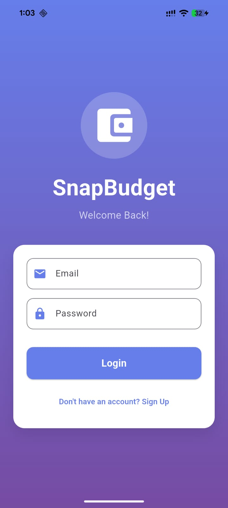
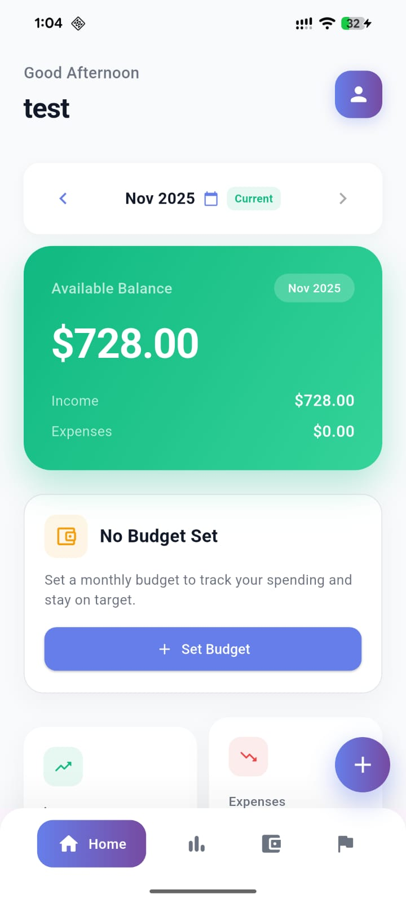
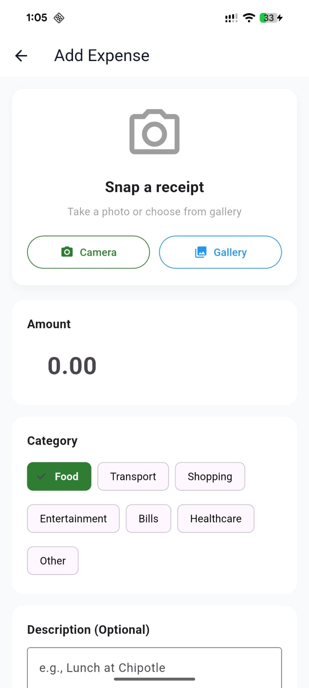
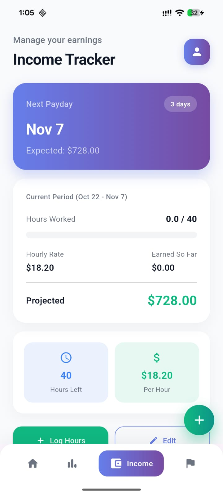
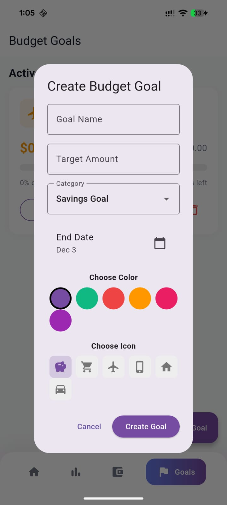
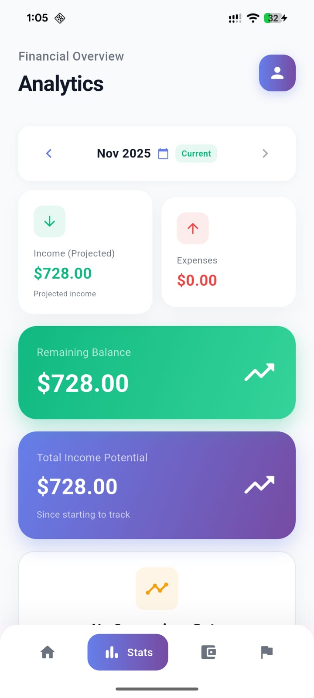
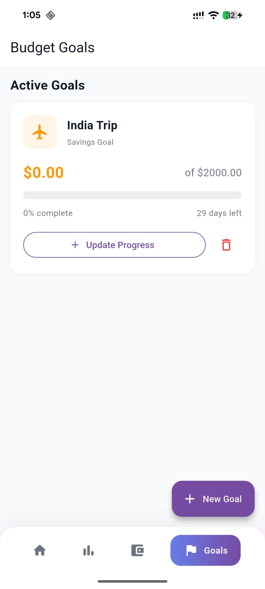
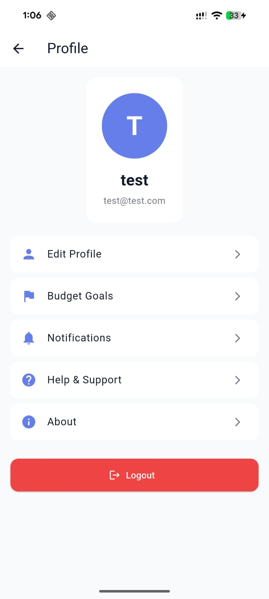

# SnapBudget - Personal Finance Management App

A modern Flutter application for managing personal finances with features like expense tracking, budget management, income monitoring, and financial analytics.

---

## 📱 Project Overview

SnapBudget is a comprehensive personal finance management app that empowers users to:

- **Track Income & Expenses**: Record and categorize all financial transactions
- **Set & Monitor Budgets**: Create monthly budgets with category-wise allocations
- **Analyze Spending**: Visualize spending patterns with interactive charts and analytics
- **Set Financial Goals**: Define and track progress towards financial objectives
- **OCR Receipt Scanning**: Automatically extract expense details from receipts using ML Kit
- **Manage Profile**: Update account settings and preferences
- **Notifications**: Receive reminders and alerts for budget tracking

The app is built using **Flutter** and integrates with **Firebase** for authentication, data storage, and cloud services. It's designed to run on Android devices (with iOS, Web, and Desktop support available).

---

## 🎨 Screenshots

| Splash Screen | Login Page | Dashboard |
|---------------|------------|-----------|
|  |  |  |

| Add Expense | Income Tracker | Budget Setup |
|------------|----------------|--------------|
|  |  |  |

| Analytics | Goals | Profile |
|-----------|-------|---------|
|  |  |  |

---

## ✨ Features

### Core Functionality
- **User Authentication**: Secure login/signup using Firebase Authentication
- **Expense Management**: Add, edit, and delete expenses with categories
- **Income Tracking**: Record multiple income sources and calculate total income
- **Budget Planning**: Set monthly budgets with category-wise breakdowns
- **Financial Goals**: Create and monitor savings goals
- **Analytics Dashboard**: Visual insights into spending patterns and trends
- **Receipt Scanning**: OCR-powered receipt scanning for automatic expense entry
- **Notifications**: Push notifications for budget alerts and reminders

---

## 🛠 Tech Stack
- **Framework**: Flutter 3.9.2+
- **Language**: Dart
- **State Management**: setState (Flutter's built-in state management)
- **Backend Services**: Firebase
  - Authentication (Firebase Auth) - User login/signup with email and password
  - Database (Cloud Firestore) - Stores expenses, budgets, income sources, and goals in real-time
  - Messaging (Firebase Cloud Messaging) - Receives push notifications from Firebase servers (background/foreground message handling)
- **ML/AI**: Google ML Kit (Text Recognition) - Scans receipt images to automatically extract amount and date using OCR
- **Local Notifications**: Flutter Local Notifications - Shows in-app notifications for budget alerts, payday reminders, large expenses, and goal progress
- **Image Processing**: Image Picker, Camera - Allows users to take photos of receipts or select from gallery for OCR processing

## 📁 Project Structure

```
SnapBudget/
├── android/
├── ios/
├── lib/                     # Main application code
│   ├── main.dart           # App entry point
│   ├── firebase_options.dart
│   ├── models/             # Data models
│   │   ├── budget.dart
│   │   ├── budget_goal.dart
│   │   ├── expense.dart
│   │   ├── income_source.dart
│   │   ├── monthly_balance.dart
│   │   └── monthly_budget.dart
│   ├── screens/            # UI screens
│   │   ├── splash_screen.dart
│   │   ├── auth_screen.dart
│   │   ├── home_screen.dart
│   │   ├── add_expense_screen.dart
│   │   ├── income_tracker_screen.dart
│   │   ├── budget_setup_screen.dart
│   │   ├── budget_goals_screen.dart
│   │   ├── analytics_screen.dart
│   │   ├── profile_screen.dart
│   │   └── notification_settings_screen.dart
│   ├── services/           # Business logic & services
│   │   ├── firebase_service.dart
│   │   ├── budget_service.dart
│   │   ├── income_calculator.dart
│   │   ├── monthly_balance_service.dart
│   │   ├── notification_service.dart
│   │   ├── ocr_service.dart
│   │   └── date_helper.dart
│   └── widgets/            # Reusable UI components
│       ├── budget_tracking_card.dart
│       ├── date_filter_widget.dart
│       ├── enhanced_balance_card.dart
│       ├── month_over_month_card.dart
│       ├── spending_insights.dart
│       └── swipeable_expense_tile.dart
├── screenshots/            # App screenshots
├── test/                   # Unit & widget tests
├── pubspec.yaml            # Flutter dependencies
├── firebase.json           # Firebase configuration
└── README.md               # This file
```